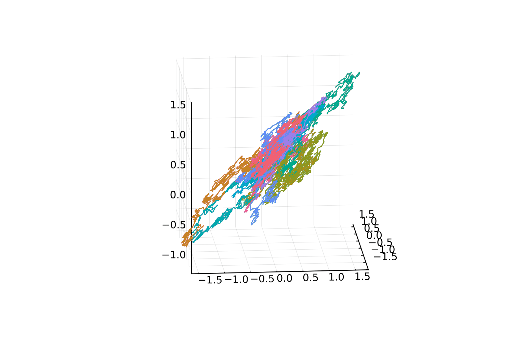

# DLRA
A straightforward implementation of the *Dynamical Low Rank Approximation* (DLRA) for SDE.

This is quite straightforward, just run ``generate_dlra_traj(x0, n, N, σ, b, h, r)`` where ``x0``is the initial datum, that is a matrix of size $d \times N$; ``n`` is the number of steps of the numerical scheme; ``N`` is the number of particles (or, through propagation of chaos, the number of trajectories); ``σ`` is the diffusion matrix, a function that maps $d$-dimensional vector onto matrices of size $d \times m$; ``b`` is the drift vector, hence a function that maps $d$-dimensional vectors onto themselves; ``h`` is the timestep; ``r`` is the targeted rank in the DLRA. Below, an example of a three-dimensional SDE DLRA-ed into "rank two" random variables -- the realisations are therefore inside a two-dimensional affine subspace of the $d$-dimensional space, as observed.

